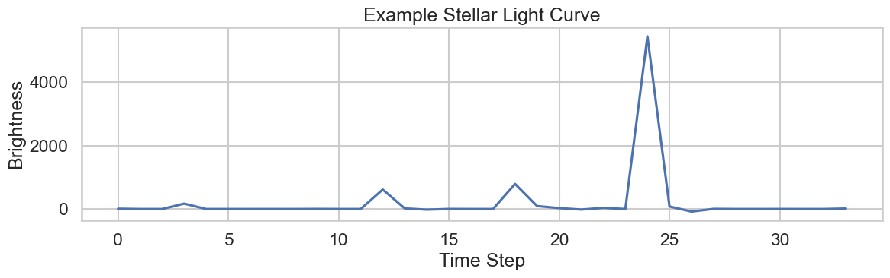

# Exoplanet Detection using Machine Learning

This project explores detecting **exoplanets** using machine learning techniques applied to **stellar light curve data**.

When a planet passes in front of a star, the brightness of the star slightly decreases.
This phenomenon is called a **transit**. By analyzing these brightness dips, machine learning models can identify potential exoplanets.

---

# Project Objective

The goal of this project is to build a **machine learning pipeline** capable of detecting potential exoplanets by analyzing patterns in stellar brightness measurements.

The project demonstrates:

• Data preprocessing
• Feature preparation
• Model training
• Model evaluation
• Light curve visualization
• Prediction of potential exoplanets

---

# Dataset

The project uses **stellar light curve data**, similar to data collected by space telescopes such as:

• **NASA Kepler Mission**
• **NASA TESS Mission**

A **light curve** represents the brightness of a star measured over time.

If a planet passes between the star and the telescope, a small **dip in brightness** appears in the light curve. Machine learning algorithms can detect these patterns and classify potential planetary signals.

---

# Machine Learning Pipeline

The notebook follows a structured workflow:

1. Load dataset
2. Data exploration
3. Data preprocessing
4. Feature preparation
5. Train machine learning models
6. Evaluate model performance
7. Visualize stellar light curves
8. Predict potential exoplanet signals

---

# Model

This project uses a **classical machine learning classifier (XGBoost)** to classify whether a stellar light curve corresponds to a potential exoplanet transit.

The model is trained on brightness time-series data extracted from light curves.

---

# Results

The model is evaluated using standard classification metrics:

• Accuracy
• Precision
• Recall
• Confusion Matrix

These metrics help assess the model's ability to correctly detect planetary transit signals.

---

## Example Light Curve

Example brightness curve of a star over time.



This plot represents stellar brightness over time, where dips may indicate the presence of an exoplanet.
---

# Technologies Used

Python
NumPy
Pandas
Scikit-learn
XGBoost
Matplotlib
Seaborn

---

# Installation

Clone the repository:

```
git clone https://github.com/Tirth-2006/ExoPlanet-Detection-ml.git
```

Navigate into the project directory:

```
cd ExoPlanet-Detection-ml
```

Install dependencies:

```
pip install -r requirements.txt
```

Run the notebook:

```
jupyter notebook
```

Open the notebook file:

```
exoplanet_detection_pipeline.ipynb
```

---

# Project Structure

```
ExoPlanet-Detection-ml
│
├── exoplanet_detection_pipeline.ipynb
├── requirements.txt
├── README.md
├── LICENSE
└── .gitignore
```

---

# Future Improvements

Possible extensions of this project include:

• Feature engineering for improved transit detection
• Hyperparameter tuning of machine learning models
• Deep learning models for time-series analysis
• Larger datasets from Kepler or TESS missions
• Automated transit detection pipelines

---

# Author

**Tirth**

Machine Learning enthusiast exploring scientific applications of AI and data analysis.

---

# Acknowledgements

Inspired by research in **astronomy and exoplanet detection** using data from missions such as **NASA Kepler and TESS**.
